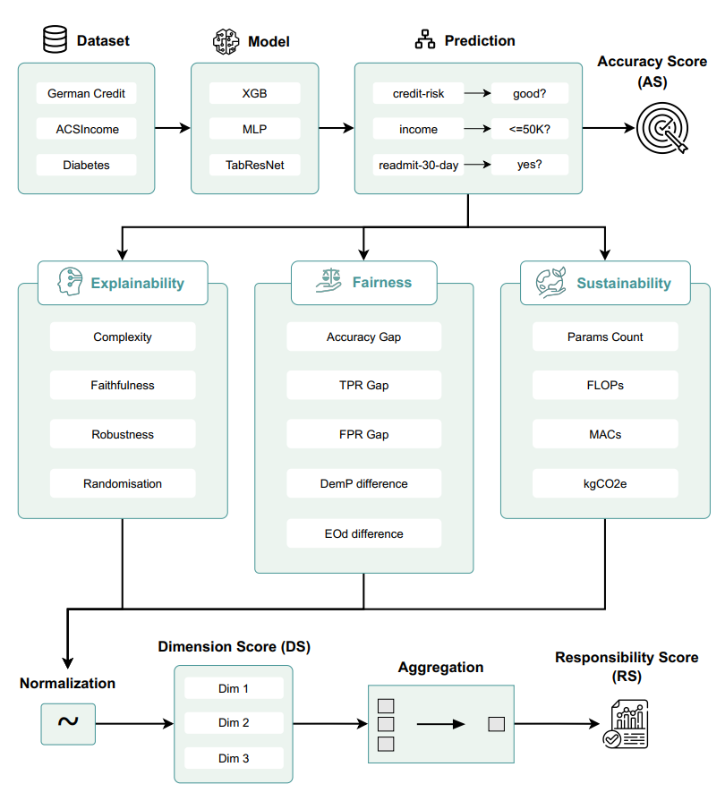
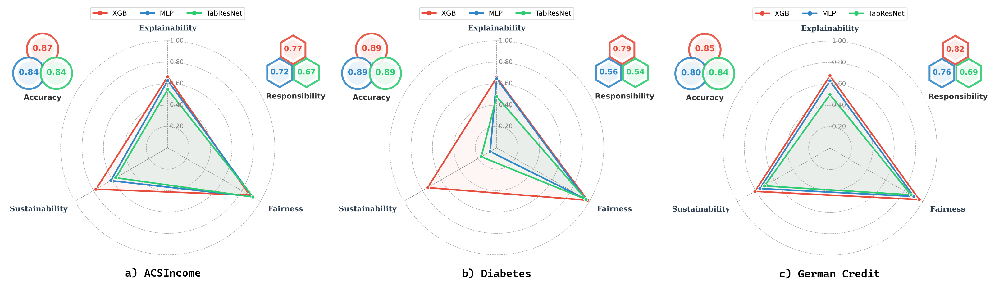

# Responsible AI

This repository contains the source code and framework for the paper:

**_Regulation of AI Models: A Systematic and Responsible Approach_**

---

## 🔍 Overview

Artificial intelligence is increasingly deployed in high-stakes domains—such as healthcare, finance, and public services—where responsible deployment is essential. However, most current evaluation approaches fail to capture the broader ethical, social, and environmental implications of model behavior.

This project introduces a unified evaluation framework that quantifies **model responsibility** across three critical dimensions:

- **Explainability** – How transparently the model links input to output  
- **Fairness** – Whether the model treats all demographic groups equitably  
- **Sustainability** – The computational and environmental costs of using the model

Using **18 established metrics**, the framework computes normalized scores for each dimension and a final **Responsibility Score**, enabling transparent and reproducible model comparisons.

---

## ⚙️ Method

We evaluate three representative model types:

- `XGBoost` – Tree-based ensemble model  
- `MLP` – Multi-layer perceptron neural network  
- `TabResNet` – Residual neural network adapted for tabular data  

These models are tested on three public tabular datasets:

- `Credit` – Financial risk classification  
- `Diabetes` – Medical condition prediction  
- `Income` – Socioeconomic status classification  

All models are trained to **comparable accuracy** to ensure fair comparison. The framework then evaluates them along the three responsibility dimensions.

<p align="center">
  
</p>

---

## 📊 Results

Our experiments reveal clear trade-offs:

- **Tree-based models** (e.g., XGBoost) offer **high explainability** and **low resource consumption**
- **Deep models** (e.g., TabResNet) show **stronger fairness**, but are **less efficient**

These insights support responsible model selection based on context-specific priorities.

<p align="center">
  
</p>

---

## 📦 Installation & Usage

```bash
git clone https://github.com/responsible-ai-framework/responsible-ai.git
cd responsible-ai
pip install -r requirements.txt
```

Run each notebook sequentially to reproduce the experiments.
Final results and scores are generated automatically in each session.
